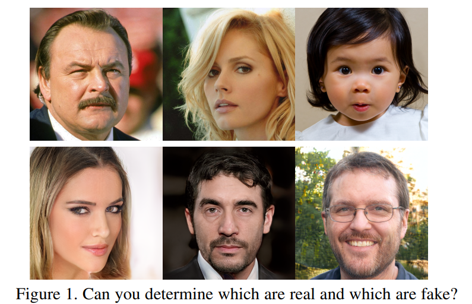

# 
## Global Texture Enhancement for Fake Face Detection in the Wild (CVPR2020)

Code for the paper [Global Texture Enhancement for Fake Face Detection in the Wild](https://arxiv.org/abs/2002.00133), CVPR 2020.

**Authors**: Zhengzhe Liu, Xiaojuan Qi, Philip H.S. Torr



## Data Preparation

Download the 10k images from FFHQ, CelebA, and generate 10k images using StyleGAN, PGGAN on the datasets. Please save the 1024*1024 resolution images with PNG format, not JPG. 

Optionally, to evaluate the low-resolution GANs, download images from CelebA dataset, and generate images using DCGAN, DRAGAN and StarGAN. 

## Inference and Evaluation

We release [the model](https://drive.google.com/) for StyleGAN-FFHQ, StyleGAN-CelebA and PGGAN-CelebA, respectively. 

Modify "root" folder and image path in test.py, and then test the images on all the datasets. 

```
python test.py
```

## Training

Generate the filelist for training. 

```
python gene.py
```

Put graminit.pth to the training folder as initialization, and start training, while evaluate the model on the validation set regularly to choose the best model. 

```
python main.py
```

## Contact
If you have any questions or suggestions about this repo, please feel free to contact me (liuzhengzhelzz@gmail.com).

